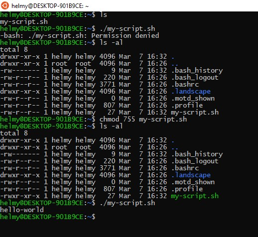
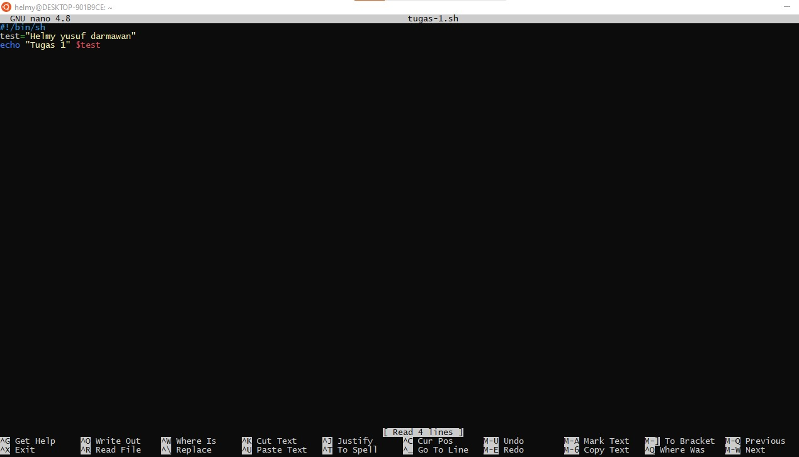
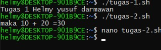
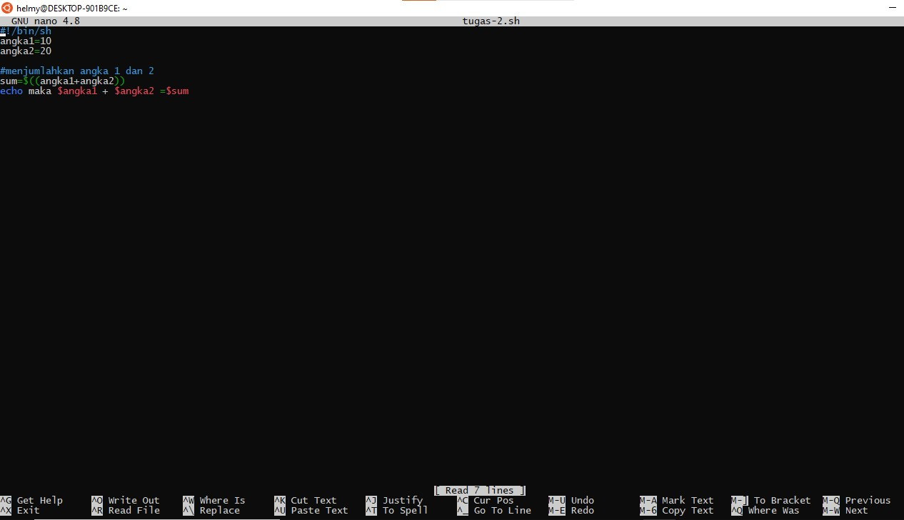
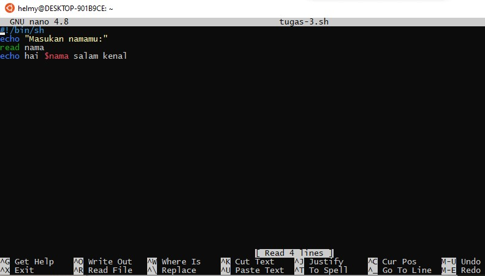
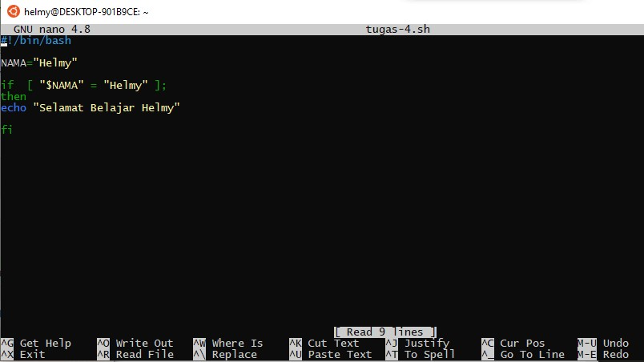
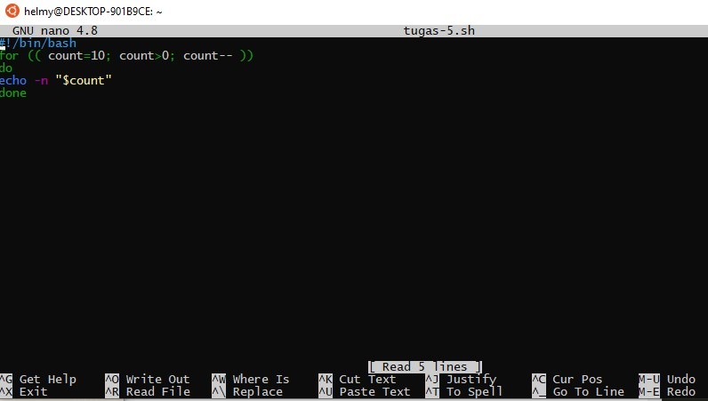
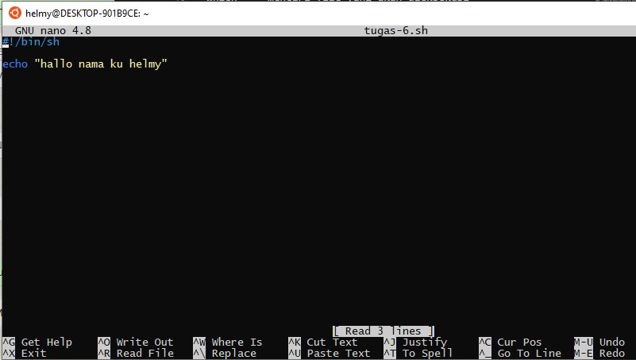
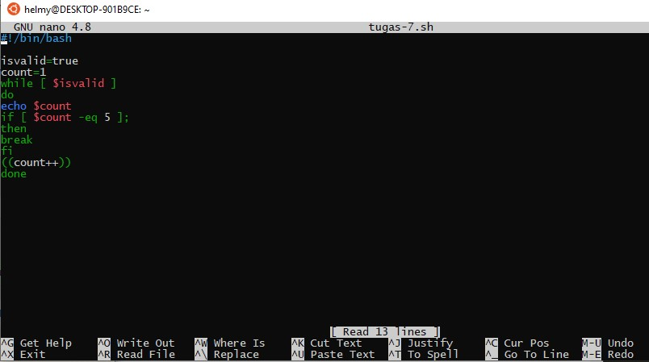
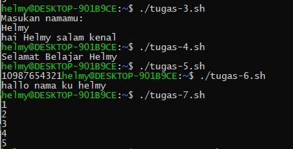

### Resume

Pada materi kali ini kita mempelajari tentang
1. Basic Linuc Command
2. Kelebihan Command line

1. sebuah utinitas dari sistem operasi linux 

-Ringan digunakan dalam penggunaannya
-dapat menyimpan script untuk meotomatiskan tugas yang sama berulang kali
- powerful karena tidak terlalu banyak memakan banyak memori dalam penggunaannya

- struktur commands linux 
command [options][paramters]
contoh 
ls -a/usr

Basic commands
cal = kalender
date = tanggal

File system commands
touch =  membuat file baru 
cat   = membuat daftar isi file atau konten >>file.txt 
cp    = menyalin file dari 1 file ke file yang berbeda
mv    = memindahkan file/mengubah nama file
rm    = menghapus directodry
mkdir = membuat directory baru
rmdir = menghapus directory yang kosong
cd    = mengganti posisi user
pwd   = mencari path dari directory

Proses Control Commands
top     = menampilkan daftar proses yang sedang berlangsung
clear   = membersihkan terminal
history = mengecek kembali command yang ingin dilihat

Utilities programs Commands
ls      = menampilkan semua file
which   = mencari file yang akan dieksekusi
sudo    = menjalakan task yang membutuhkan hak akses
find    = Mencari file dan directory

File Access Permissions
chmod   = membaca dan menulis permission dari directory
chown   = mengubah kepemilikan file ke username

### Task
1. Cobalah semua Linux Command yang sudah dijelaskan di materi ini

2. Buatlah Shell Script dengan minimal 5 Command dan jelaskan

1. berikut Hasil linux yang sudah dicoba

Berikut Pemrograman pada Linux command sesuai dengan materi

Berikut Pemrograman pada Linux command yang ada pada materi

Berikut Hasil execute dari 

2. Buatlah Shell Script dengan minimal 5 Command dan jelaskan

User mengetik namanya lalu ketika di execute maka hasilnya hai $nama kamu salam kenal

kita menginisialisasi bahwa variabel nama = helmy nah jika nama = helmy  maka output yang di echo akan muncul, namun jika nama bukan helmy maka echo tidak bisa muncul.

 count 10 akan terus berkurang sampai mencapai nilai 1

memprint hallo nama ku helmy 

isvalid dengan variabel 1-5

hasil execute

